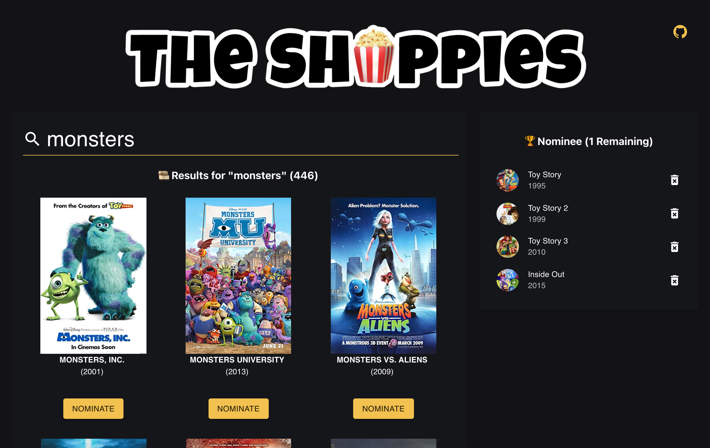
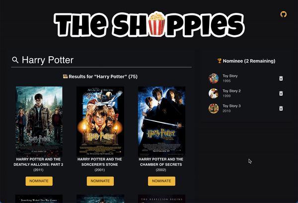
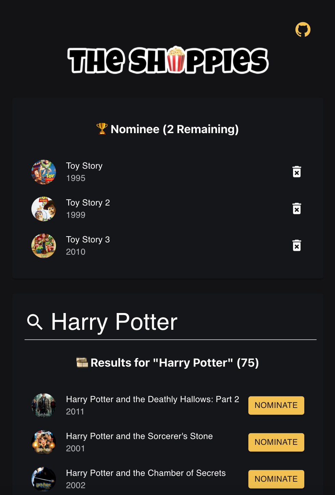

# The Shoppies

An app to help manage movie nominations for the upcoming Shoppies

Demo: https://nancyyeh.github.io/the-shoppies/

<a href="https://nancyyeh.github.io/the-shoppies/"></a>

# 💭 Design Decisions

- Since OMDB also only has 1,000 daily limit, I added a debounce on the search query so there is a delay in search query when the user is typing. Solves: overloading the OMDB database / hitting daily limits
- Use Material-UI library to make it look clean, simple, modern, and responsive!
- Responsive design to display search results and nomination list
  - Wide Screen(desktop): 2 column grid layout - Search Results 2/3 of screen, nomination list 1/3 of screen.
    
    - Nomination list is sticked to top while scrolling.
      
  - Narrow Screen(mobile): 1 column stacked layout - Search results will turn from card view into listed view when width is < 600px.
    
- Display movie poster returned from OMDB as avator. If no poster is returned from OMDB, a generic movie icon is displayed for list view, and blank placeholder is displayed for card view.
- Use pagination to show more research results.
- Use local storage to save nominated movies.

# 💡Features

- Search OMDB and display the results (movies only) ✅
- Add a movie from the search results to nomination list ✅
- View the list of films already nominated ✅
- Remove a nominee from the nomination list ✅
- Save nomination lists if the user leaves the page (using local storage) ✅
- Debounce on search so it doesn't overload the search query ✅
- Pagination for search results ✅
- Animated alert when five movies are nominated and display submit button ✅
- Animated alert of success submission along with clear nominations and search terms ✅
- Github icon to link to source code ✅

# 🖥️ Tech

- React (Create-React-App)
- CSS
- HTML
- Material-UI
- GitHub pages

# 🛠️ Future Improvements

- Include a backend to hide API key for OMDB as this creates secruity risk
- Save down the submission to a backend API
- Add social share buttons after submission

# 🚀 Deployment

To run

```
npm start
```

To deploy

```
npm run deploy
```

# 📝 Licenses

MIT license

Images used:

- emojis
- Trophy on pedestals <a href="http://www.freepik.com">Designed by macrovector / Freepik</a>
