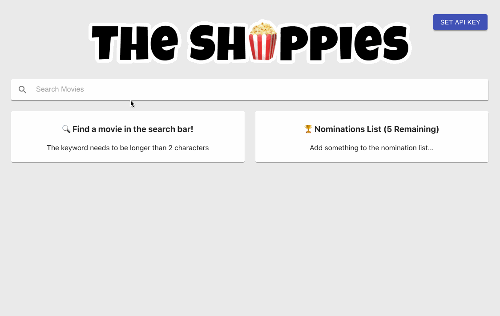

# The Shoppies

An app to help manage movie nomination for the upcoming Shoppies

GitHub Pages: https://nancyyeh.github.io/the-shoppies/

# 💭 Design Decisions

- Since this is a front-end only app, and I did not want to use any backend code. There is no way to securely store the OMDB API keys, therefore I decided to create a dialog where user can input the API key. Ths API key is stored in local storage so user will only have to input it once. For ease of testing, I have inserted the API key. However if this is a production code, there will be a dedicated backend so the API key is not exposed.
- Since OMDB also only has 1,000 daily limit, I added a debounce on the search query so there is a delay in search query when the user is typing. Solves: overloading the OMDB database / hitting daily limits
- Use Material-UI library to make it look clean, simple, modern, and responsive!
- Use movie poster returned from OMDB as avator of the movie. If no poster is returned from OMDB, it will use a movie icon. In the future , if we want to create nomination list for series and esposides, using icons can used to differentiate the different types in the future. (currenly only showing movies)
- pagination to show more research results

# 💡Features

- Search OMDB and display the results (movies only) ✅ Aug 24
- Add a movie from the search results to our nomination list ✅ Aug 24
- View the list of films already nominated ✅ Aug 24
- Remove a nominee from the nomination list ✅ Aug 24
- Save nomination lists if the user leaves the page (using local storage) ✅ Aug 24
- Input API key ✅ Aug 25
- Added Pagination for search results ✅ Aug 30
- Animated snackbar alert ✅ Sep 1
- Debounce on search so it doesn't overload the search query ✅ Sep 2
- Included a Restart button when five films has been selected, to restart and remove all nomination selections and can be used as submit button for future improvements ✅ Sep 7

# 🖥️ Tech

- React (Create-React-App)
- CSS
- HTML
- Material-UI

# 🛠️ Future Improvements

- Update layout to show all movies on top with blocks and posters / search bar and search results below
- Submit the nomination
- Share the submission

# 🚀 License

MIT license
